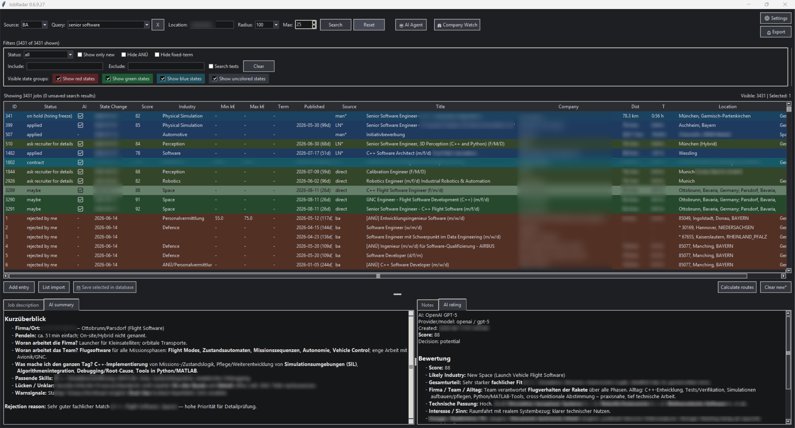
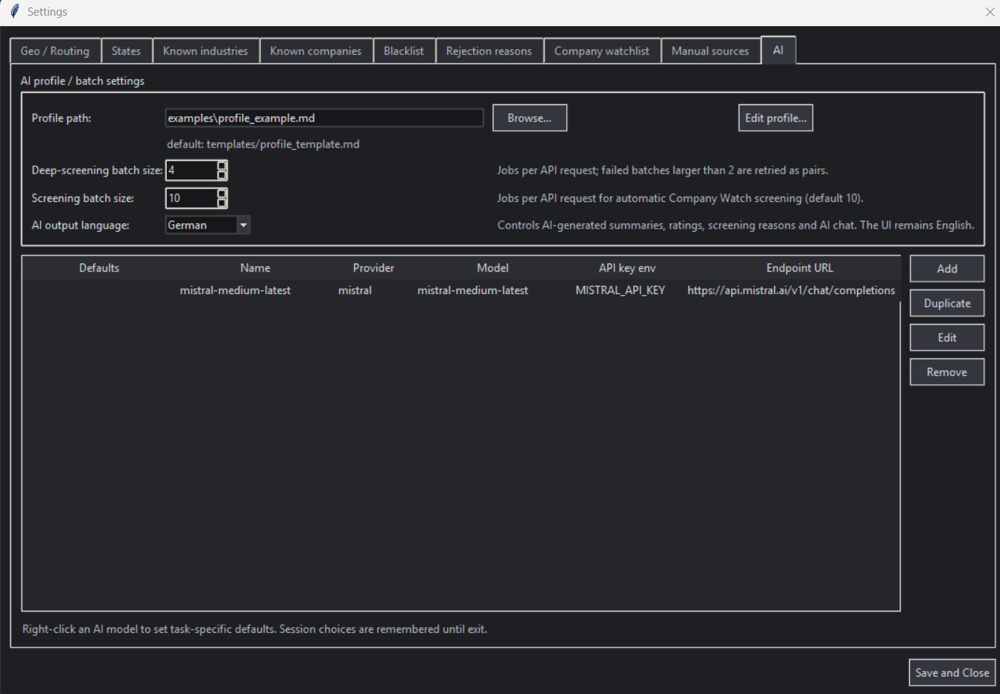
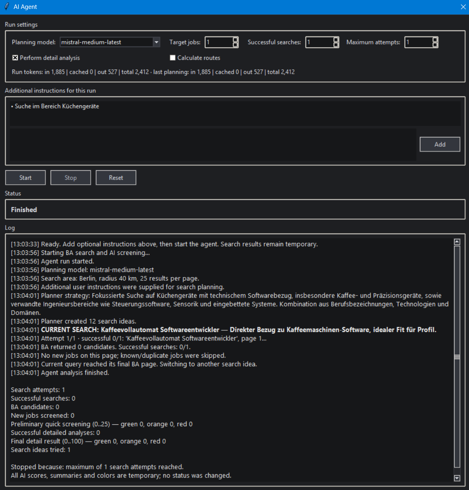
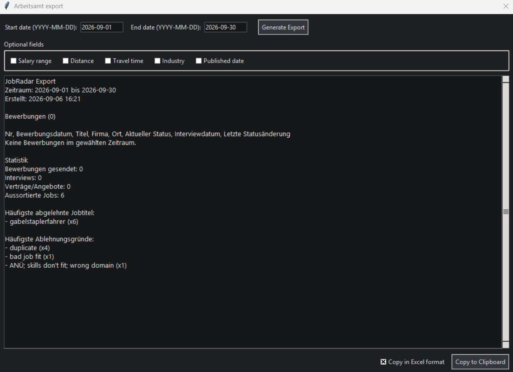
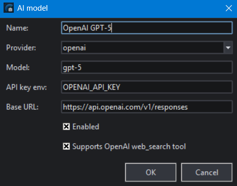

# JobRadar

> ⚠️ **Experimental, 100% vibe-coded software**
>
> JobRadar was created entirely by prompting AI systems to generate and modify the code. The maintainer did **not** manually review or audit the generated source code and treats the codebase largely as a black box.
>
> This documentation is also (mostly) AI-generated.
>
> **Use JobRadar at your own risk.** Verify important results yourself and keep copies of data you would not want to lose.

JobRadar is a personal desktop application for **finding, filtering, remembering, evaluating and tracking job advertisements**.

It started from one simple idea:

> **Search for jobs, remember everything you have already reviewed, stop showing the same unwanted jobs again, and automatically exclude companies you already know you do not want to work for.**

Today JobRadar has grown into a larger job-search workspace with a persistent local SQLite database, duplicate detection, a company blacklist, application tracking, route/distance calculation, AI-assisted job evaluation, an AI search agent, manual job-list import and direct monitoring of company career pages.

The application is currently focused on the German job market. Its built-in general job search currently searches the **Bundesagentur für Arbeit (BA)** job database.

---

## Contents

- [Why use JobRadar?](#why-use-jobradar)
- [Key features](#key-features)
- [Installation](#installation)
- [Quick Start](#quick-start)
- [Quick Start with AI](#quick-start-with-ai)
- [Documentation](#documentation)
  - [List Import](#list-import) 
  - [AI setup and usage](#ai-setup-and-usage)
  - [Personal AI profile](#personal-ai-profile)
  - [Screening](#screening)
  - [Deep Screening](#deep-screening)
  - [Reformat job descriptions with AI](#reformat-job-descriptions-with-ai)
  - [AI Agent](#ai-agent)
  - [Company Watch](#company-watch)
  - [Routing and distance calculation](#routing-and-distance-calculation)
  - [Bundesagentur für Arbeit API](#bundesagentur-für-arbeit-api)
- [Experimental software and limitations](#experimental-software-and-limitations)
- [Extending JobRadar with AI](#extending-jobradar-with-ai)
- [Contributing](#contributing)

---

## Screenshots



*JobRadar with a real-world job database. Company names and some personal data have been anonymized.*

<br>



*JobRadar settings dialog - showing the AI settings.*

<br>



*JobRadar AI Agent window after a run.*

<br>



*JobRadar application export dialog.*

---

# Why use JobRadar?

Repeated job searching on professional platforms can become frustrating very quickly for several reasons:

- The same vacancies appear again and again and one looses overview of what has already been seen
- Vacancies of certain unwanted companies cannot be filtered out
- Driving distances/times are only very roughly known
- You need to read a lot of text for each vacancy (of which some are badly formatted) until you finally know if the job fits you

JobRadar tries to solve these problems by:

- Keeping a persistent history of what you have already seen
- Maintaining a company blacklist
- Offering route calculation (via external services)
- Offering AI assistance (via paid API services) for:
  - job evaluations, summaries, recommendations and questions
  - automated job search
  - job description re-formatting to a human-readable form

A typical workflow is:

1. Search for jobs.
2. Determine and check commute distances.
3. Optionally use **AI Screening** to compare new jobs with your personal profile.
4. Optionally ask AI about job description details.
5. Review promising results.
6. Reject jobs you never want to see again.
7. Keep interesting jobs.
8. Change their state as your application progresses.
9. Repeat the search later.

A persistent database storing your personal search results, states and notes is the core of the application.

---

# Key features

## Persistent job database and duplicate detection

Jobs are stored locally in an SQLite database. Once the file was created it can be found in the JobRadar root folder as `jobradar.db`. The file is created automatically as soon as an action was performed that requires storage.

> ℹ️ For Windows you can use the free software `DB Browser (SQLCipher)` to take a look at your db-file and/or make alterations (if you know what you are doing!).

JobRadar uses several mechanisms to recognize jobs that are already known:

- stable source IDs,
- normalized URLs,
- exact content matches,
- fuzzy duplicate scoring across company names, titles, locations and descriptions.

Probable duplicates may be shown with a prefix such as:

```text
[DUP 94%]
```

Exact duplicates can be rejected automatically.

This matters because the same vacancy may appear in repeated searches, through multiple sources, both on the BA portal and on a company career page, or after small title/company/location changes.

---

## Company blacklist

You can blacklist companies whose jobs you do not want to see.

Jobs from blacklisted companies are rejected early, before unnecessary duplicate analysis or AI processing.

---

## Track interesting jobs and applications

Interesting jobs can remain in the database and move through states such as:

```text
new
needs review
maybe
interesting
apply
applied
interview
rejected by me
rejected by company
expired
```

> 💡 In addition to the predefined elements you can define custom states!

The workflow is intentionally flexible.

> ℹ️ **Most actions happen through context menus.**

Right-click the **main job table** for actions such as:

- changing state,
- rejecting jobs,
- **Shallow screen selected jobs**,
- **Deep screen selected jobs**,
- route/location actions,
- duplicate inspection,
- opening URLs.

Right-click the **job-description text area** for description-specific actions such as **Reformat with AI**.

---

## Export applications

Jobs you have applied to can be exported as a list (see [Screenshots](#screenshots)) as plain text or in Excel format (enables direct paste via `Strg+V` into an Excel table).

This can be useful, for example, when the German employment agency requests a record of applications.

> ⚠️ The export is a practical data export, **not a polished official document**. Review and format it manually before submitting it anywhere important.

---

## Manual list import

JobRadar can import manually copied result lists, for example from LinkedIn or Indeed.

This is intentionally a **manual workflow**.

A practical workflow is:

1. Search on the external job site yourself.
2. Copy the visible result list into JobRadar's **List Import**.
3. Let JobRadar parse the available title/company/location metadata.
4. For jobs that look interesting, manually copy the individual job advertisement into JobRadar when necessary.

See [docs/LIST_IMPORT_LINKEDIN.md](docs/LIST_IMPORT_LINKEDIN.md) for details.

> ℹ️ JobRadar does not promise automated scraping of third-party portals such as LinkedIn or Indeed. Manually copying individual advertisements may be less convenient, but it still lets JobRadar remember what you have already reviewed.

---

# Installation

The existing installation workflow is deliberately simple. Yet, the following tools must be installed on your system:

- Python 3.10 or later (3.11 recommended): [Download](https://www.python.org/downloads/)
- Git (for example [Tortoise Git](https://tortoisegit.org/download/) for Windows)

### Clone the repository via Git

Open a command prompt at the target location for the JobRadar installation and enter:

```bash
git clone https://github.com/Single-MAlt-td/JobRadar.git
cd JobRadar
```

### Create a virtual environment for Python

```bash
python -m venv .venv
```

#### Activate the virtual environment:

- Windows CMD: `.venv\Scripts\activate`
- Windows PowerShell: `.venv\Scripts\Activate.ps1`
- Linux/macOS-style shell: `source .venv/bin/activate`

> ℹ️ Whenever you open a new terminal later, activate `.venv` again before running the app or altering the installation.

### Install Python dependencies

Ensure your virtual environment is activated!

Then:

```bash
pip install -r requirements.txt
```

> ℹ️ Whenever you open a new terminal later, activate `.venv` again before running the app or altering the installation.


## Starting the app

1. Open a console in the JobRadar root folder
2. [Activate the virtual environment](#activate-the-virtual-environment)
3. Execute: `python run.py`

---

# Quick Start

This section is designed to get a new user from a fresh installation to a first complete JobRadar workflow as quickly as possible.

Read [Starting the app](#starting-the-app) to see how to start JobRadar.

## 1. Check Settings first

Open **Settings** and go through the tabs once.

At minimum:

- navigate through all Settings tabs to get an overview
- in the Geo / Routing tab:
  - enter your home/base address (e.g. in the form: `road-name, ZIP-code location` (for data security, do not enter your house number; you could also choose another nearby and official address, since route calculation must not be accurate to the meter)),
  - configure **ORS** for routing/geocoding if you want distance calculations (see [docs/ROUTING.md](docs/ROUTING.md) or leave defaults for initial testing),
- in the AI tab:
  - configure **AI** (see [AI setup and usage](#ai-setup-and-usage)) if you want to use Screening, Deep Screening, Ask AI or the AI Agent.
  - use the example profile or create your own one (see [Personal AI profile](#personal-ai-profile))
- close the Settings dialog via the **Save and Close** button when you are done

💡 ORS and AI are optional, but both are recommended if you want to use JobRadar beyond the basic database/search workflow.

---

## 2. Run your first BA search

Leave the source set to **BA** (there aren't any other options available right now anyway).

Enter:

- a search term, for example: `Gabelstaplerfahrer`
- a location, for example: `Berlin`
- a search radius (or leave the default)

Start the search via the `Search` button or just press `ENTER`.

The results appear in the main table.

---

## 3. Calculate a route for one job

Select a job, then right-click:

```text
Route/Location → Calculate route (location)
```

If routing is configured correctly, JobRadar should update the route distance and estimated travel time for that job.

> ⚠️ But note that the computed distance is calculated only from your home address to the target city! But:
> 
> 💡 Note that BA search results usually contain an exact address or geo coordinates of the work location. To calculate a precise route to this location, choose `Route/Location → Calculate route (exact address)` instead. The exact route calculation should only be needed for jobs that particularly interest you. Exact addresses for manually added entries can currently not be entered, since they must be found out manually via GoogleMaps (or similar) anyway. 

> 💡 For first tests, if ORS is not set up, start with only one or a few jobs to test the route calculation.

> ℹ️ Sometimes routing fails, mostly due to malformed target addresses. By choosing **Set alias** from the **Routing / Location** context menu, you can override it with a well-formed address and try again. 

> ℹ️ If the location shown in the table is prepended with a `*` symbol, this means multiple working locations are available. JobRadar automatically chooses the closest one by direct distance. You can choose another location manually in the context menu under **Routing / Location > Set location**

---

## 4. Save a job by changing its status

Right-click the job:

```text
Set status → needs review
```

This saves the job in the local database.

> ℹ️ The row may move to the bottom of the table after the state change because of the active sorting/filtering.

---

## 5. Add notes

Select the saved job.

Enter something in the **Notes** field and save it.

This is a simple way to confirm that the entry is now persistent and can be edited independently of the original search result.

---

## 6. Reject a job

If the job is not useful, right-click it and choose:

```text
Reject
```

Select an existing reject reason or add a new one.

After rejection, the job normally disappears from the standard view.

---

## 7. Show rejected jobs again

Enable:

```text
Show red states
```

The rejected job should become visible again.

Right-click it and choose:

```text
Edit Entry
```

The reject reason can be seen in the entry details/notes area.

---

## 8. Show only new jobs

Enable:

```text
Show only new
```

The previously saved job is hidden again because it is no longer new.

This is one of JobRadar's central ideas: once a job has been dealt with, you can keep future searches focused on genuinely new results.

---

## 9. Return to the normal view

Disable both:

```text
Show red states
Show only new
```

You are now back in the normal table view.

---

## 10. Learn main table features

The main table:

- supports multi-select via:
  - **Ctrl** key and **left mouse button**
  - **Shift** key and **left mouse button**
  - **Ctrl+A** to select all
- allows to perform many context menu options for multiple selected jobs at once
- allows sorting by any column by clicking on the title
- lets you erase entries with **Del** key 
>💡 Unsaved jobs marked as `new*` can re-appear in a new search when you just delete them from the list. To be filtered out, they must be rejected and thereby stored in the database.

> ℹ️ To delete ALL unsaved `new*` jobs from the table, you can click the **Clear new*** button. This is useful if the search result delivers entirely unwanted entries due to a misspelled or test query.

---

## 11. Assign an industry

> ℹ️ The industry is the main field of operation of a company, e.g. Automotive, MedTech, Logistics.

Right-click a job and select:

```text
Set industry
```

Choose an existing industry or create a new one.

Setting industries is optional, but helps organize jobs and can also be useful when reviewing larger result sets.

---

## 12. Optional: calculate routes for multiple jobs

If ORS is configured, you can use the main **Calculate routes** button to fill all missing route calculations.

> ⚠️ Start with only a small number of jobs. Bulk routing can take time and sends multiple requests to the configured services. Also be aware that the **Calculate routes** button calculates routes for ALL entries in the table, for which a route is not yet available! To calculate routes only for selected entries, use the context menu!

---

# Quick Start with AI

Continue here only if AI is configured.

## 12. Run Shallow Screening

Select one or more jobs, then right-click:

```text
AI → Shallow screen selected jobs
```

Then:

1. click **Start analysis**,
2. wait for the result,
3. click **Apply AI results**,
4. close the AI window.

Now inspect:

- the **AI Summary** area in the lower-left part of the main window,
- the AI symbol in the table,
- the AI score/color if available.

Shallow Screening does **not** read the full job description. It evaluates compact job metadata such as title, company, location and other structured fields.

---

## 13. Run Deep Screening

Right-click:

```text
AI → Deep screen selected jobs
```

Then:

1. click **Start analysis**,
2. wait for the analysis,
3. close the AI window.

Afterwards:

- the AI Summary should be updated,
- an **AI Rating** should be available next to Notes,
- the table score/AI symbol may have changed.

If the analyzed job was not already stored, click:

```text
Save selected in database
```

to persist it (if the button is not clickable, you might need to click on the entry in the table again to select it).

You can then reject jobs that the detailed analysis confirms are a poor fit.

> ⚠️ Deep Screening reads the full job description and is therefore slower and usually more expensive than Shallow Screening.

---

## 14. Ask AI about a job

Right-click:

```text
AI → Ask AI
```

Review the checkboxes that control which job/profile data is sent to the AI provider. For a first test, the defaults can usually remain unchanged.

Enter a simple question such as:

```text
What is this job about?
```

Click **Send** or press **ENTER** and inspect the response.

> ℹ️ Your AI conversations are stored in the database and will not be lost!

---

## 15. Try the AI Agent

Click the **AI Agent** button (consider clearing the list with the **Clear new*** button first).

For a minimal first test, use:

```text
Target jobs:           1
Successful searches:   1
Maximum attempts:      1
```

In the free-text field, enter:

```text
Suche im Bereich Küchengeräte
```

Then:

1. click **Add**,
2. click **Start**.

> ⚠️ The AI Agent may independently trigger Deep Screenings and can therefore generate noticeable API costs even during relatively small runs.

> 💡 The main purpose of the AI Agent is to figure out promising search terms based on your profile and to perform the searches automatically. This might be only useful if you run out of ideas what to search for.  

---

# Documentation

## AI setup and usage

> ⚠️ **Commercial AI APIs cost real money.**

JobRadar sends requests through the provider API you configure. Costs depend on provider, model, prompt length, number of jobs, batch sizes and retries.

Currently supported backends include:

- **OpenAI**
- **Mistral**
- **Ollama** for local models

### AI output language

JobRadar's interface remains English, but **Settings → AI → AI output language** controls the language used for AI-generated Screening results, Deep Screening summaries/ratings, AI chat and other user-facing AI text.

Current choices:

- **German** (default, preserving the original JobRadar behavior)
- **English**

The profile itself can be written in either language. The selected output language is explicitly included in the AI prompts, so changing the profile language alone does **not** determine the output language.

Other providers such as Anthropic Claude or Google Gemini are not currently supported out of the box.

### Adding AI models

Click the **Add** button to open the dialog for adding a model:



- Choose the Provider from the list (currently only `openai, mistral, ollama` are available)
- Enter the name of the model from the chosen provider you like to add (e.g. `gpt-5`)
- Enter a display name, which is shown in JobRadar as alias for the model name (e.g. `OpenAI GPT-5`)
- Enter the name of the environment variable that holds the API key for the chosen provider
- Check the provider docs in case the pre-filled base URL is outdated and adapt it accordingly
- If you know the model supports web-search, activate the last checkbox (only tested with OpenAI)
- Click **OK** to add the model to the list in the settings

> 💡 In JobRadar you can always choose which model to use for an AI action from a dropdown list (except for job description re-formatting). To not bother about that, you can right-click a list entry and set the selected model as default for certain actions. It is recommended to use cheaper models for easy tasks like job description re-formatting, shallow screening and list import. Use heavier models for important tasks like deep screening and chatting. 


### Maintainer recommendation

JobRadar is used by the maintainer with the following models and assignments:

| model name              | provider | default assignment      |
|-------------------------|----------|-------------------------|
| `gpt-5`                 | OpenAI   | Chat; Detailed analysis |
| `gpt-5-mini`            | OpenAI   | Agent; Screening        |
| `mistral-medium-latest` | Mistral  | List parser; Reformat   |


### API keys and environment variables

> ⚠️ Do not hard-code API keys into source files and do not commit them to Git!

Recommended approach:

1. Create the API key at the provider.
2. Store the secret in an operating-system environment variable.
3. Enter only the **environment-variable name** in JobRadar's settings.

Official references:

- OpenAI API keys: https://help.openai.com/en/articles/4936850-where-do-i-find-my-openai-api-key
- Mistral API setup/key creation: https://docs.mistral.ai/getting-started/quickstarts/developer/first-api-request
- How to create environment variables:
  - Windows 11: https://www.computerhope.com/issues/ch000549.htm#windows11
  - Linux: https://www.computerhope.com/issues/ch001647.htm

Example variable names:

```text
OPENAI_API_KEY
MISTRAL_API_KEY
ORS_API_KEY
```

After creating a persistent environment variable, restart terminals/IDEs that were already open so the new process can inherit it.

---

## Personal AI profile

AI evaluation is based on a personal profile describing what kind of work fits you.

A blank template is provided at:

```text
<repository root>/templates/profile_template.md
```

A fictional completed is be provided at:

```text
<repository root>/examples/profile_example.md
```

Useful profile topics include:

- professional experience,
- skills,
- preferred technologies,
- preferred tasks,
- disliked tasks,
- desired industries,
- salary expectations,
- location constraints,
- remote/hybrid preferences,
- hard exclusions,
- work-style preferences.

You can create and update your profile in Settings/AI via the `Edit profile...` button. You can enter any relative path under `Profile path`, the file will be created if it does not yet exist (but will be empty).

> ℹ️ You can write your profile in any language, the AI will understand. 

---

## Screening

In the UI, the lightweight AI evaluation is called **Screening**.

Run **AI > Shallow screen selected jobs** from the **main job-table context menu** for one or more selected jobs.

Screening intentionally **does not read the full job description**. It is a fast first-pass evaluation based on compact information such as:

- job title,
- company,
- location,
- employment metadata,
- fixed-term information,
- salary if available,
- other small structured fields.

It is intended to cheaply identify obviously irrelevant jobs and prioritize promising ones.

💡 **Recommendation:** Use Screening for larger batches. Use Deep Screening only when the job deserves a full-description analysis.

---

## Deep Screening

Run **AI > Deep screen selected jobs** from the main job-table context menu.

Deep Screening reads the full job description and compares it in much more detail with your personal profile.

It is more expensive and slower than Screening.

Detailed analysis is processed in configurable batches. Smaller batches are generally more robust while larger batches may reduce repeated profile overhead.

---

## Reformat job descriptions with AI

Right-click the **job-description text area** and choose the reformat action (it might a bit until the description is updated).

This is separate from the main-table context menu.

> 💡 **Recommendation:** Use a relatively inexpensive model for reformatting. This task generally does not require your strongest reasoning model.

The maintainer currently uses:

```text
mistral-medium-latest
```

Treat this as an example only! Model names, quality and pricing can change.

---

## AI Agent

The AI Agent can autonomously perform broader job-search workflows and evaluate results according to your configured profile.

> ⚠️ **The Agent may independently trigger Deep Screenings. This can make an Agent run noticeably more expensive than ordinary Screening.**

As a rough anecdotal example, the maintainer has seen Agent runs involving roughly 20 searches plus evaluations cost around **€1 per run**. This is not a price guarantee: actual cost depends heavily on models, prompt sizes and the number of Deep Screenings.

---

## List Import

JobRadar can import manually copied result lists, for example from LinkedIn or Indeed.

A dedicated screenshot-based guide can be found here:

**[docs/LIST_IMPORT_LINKEDIN.md](docs/LIST_IMPORT_LINKEDIN.md)**

---

## Company Watch

Company Watch searches company career pages directly.

### Priority

Each company can have a priority.

Priority does **not** change how well a job matches you. It is simply a way to control which companies are checked first and which priority groups are included in a Company Watch run.

For example, you can run only Priority 1 companies when you want a quick check of your favorite employers.

### Finding the correct career URL

Usually:

1. Open the company's website.
2. Find **Careers**, **Jobs** or **Open Positions**.
3. Navigate to the page containing the vacancy list.
4. Use that URL as Career URL.
5. Run **Detect system**.

Sometimes the useful entry point is one level before the actual search backend.

Example:

```text
https://jobs.dlr.de/?locale=de_DE
```

A large career source may take a long time to query.

Stress-test example:

```text
https://jobs.bosch.com/en?pages=1&country=de&division=ETAS
```

> ⚠️ This particular source may make the UI appear stuck for a long time while a very large underlying job dataset is retrieved and processed. It is useful as a real-world stress-test, but it is a poor first Company Watch example.

### Supported career systems

JobRadar currently contains adapters for systems including:

- Personio
- Greenhouse
- SmartRecruiters
- SuccessFactors
- Workday
- Recruitee
- JOIN
- Ashby
- BITE

Support is incomplete. Career sites change, customer-specific implementations vary, and some sites block automated HTTP requests.

Use **Diagnose career source** when an adapter fails.

> ⚠️ Note that executing a company watch run may spam your main table! Unfortunately, to ensure irrelevant jobs are not shown again in another run, you must reject all unfitting jobs! This can be annoying for large companies which offer hundreds of jobs, but it must only be done once.

---

## Routing and distance calculation

For the detailed explanation of ORS, Nominatim, OSRM Demo and Direct Estimate, see:

**[docs/ROUTING.md](docs/ROUTING.md)**

Short recommendation:

> ✅ For most users: use **ORS for both geocoding and routing**.

---

## Bundesagentur für Arbeit API

The built-in general search relies on the Bundesagentur für Arbeit job API.

At the time of writing, JobRadar uses the **v6 search endpoint**.

> ⚠️ The BA API has changed before and may change again.
>
> If BA search suddenly stops working while the rest of JobRadar still launches normally, an upstream API change may be responsible.

A coding AI can often update the integration if you provide it with:

- the current importer code,
- an example failing response/error,
- a current API response or endpoint information.

---

# Experimental software and limitations

JobRadar is not polished commercial software.

Potential problems include:

- career adapters failing for specific companies,
- 403 responses and timeouts,
- third-party API changes,
- malformed descriptions,
- inconsistent external locations,
- incorrect geocoding,
- duplicate false positives/negatives,
- incorrect AI output,
- AI timeouts,
- GUI edge cases.

💡 An occasional backup copy of `jobradar.db` is recommended.

Do not rely on JobRadar as the sole record of an important application.

---

# Extending JobRadar with AI

Because JobRadar itself was created through AI-generated coding, using a coding AI to extend it is an intended workflow.

Example prompts and practical guidance have been moved to:

**[docs/AI_EXTENSION_PROMPTS.md](docs/AI_EXTENSION_PROMPTS.md)**

This document includes prompts for:

- adding an AI provider,
- adding a Company Watch adapter,
- updating a broken external API,
- making targeted bug fixes.

> ⚠️ Before sending source code to an AI service, make sure you do **not** include `jobradar.db`, API keys, personal profiles or other private data.

---

# Contributing

See **[docs/CONTRIBUTING.md](docs/CONTRIBUTING.md)** for the Git/Fork/Branch/Pull-Request workflow.

Contributions are welcome, especially:

- career-system adapters,
- AI provider integrations,
- bug fixes,
- diagnostics,
- documentation corrections.

---

# License

A public release can use the **MIT License** if that matches the maintainer's intent.

Add the standard `LICENSE` file at the repository root before publishing.
