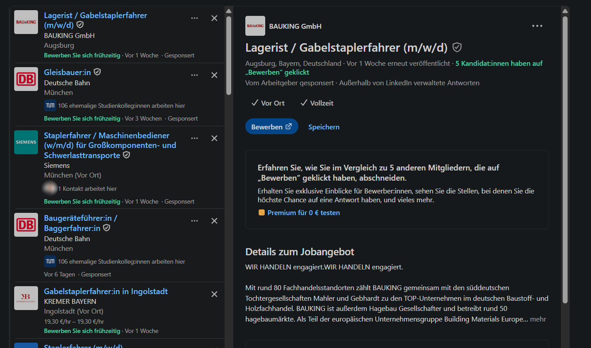
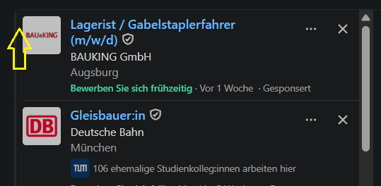
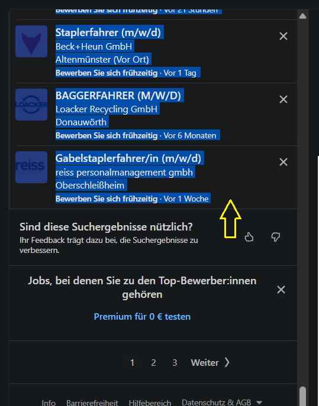
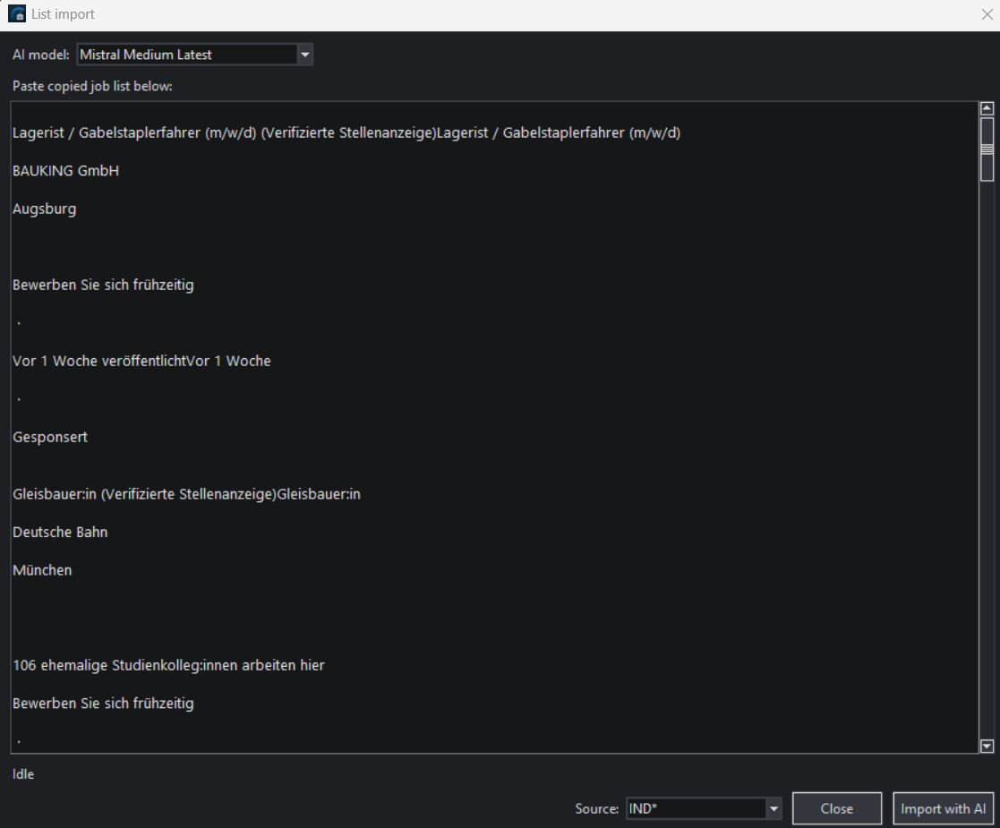
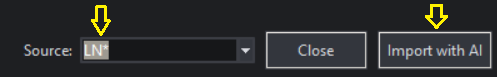
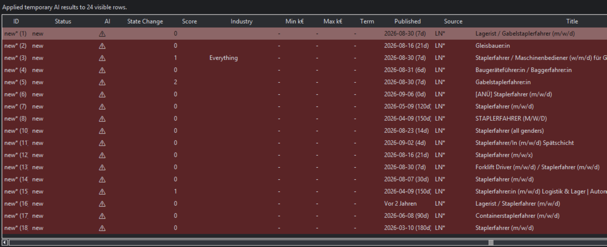
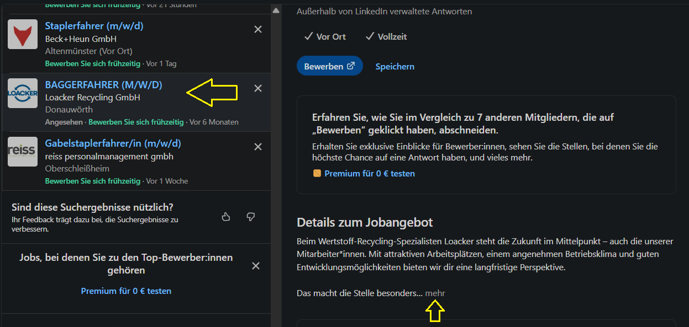
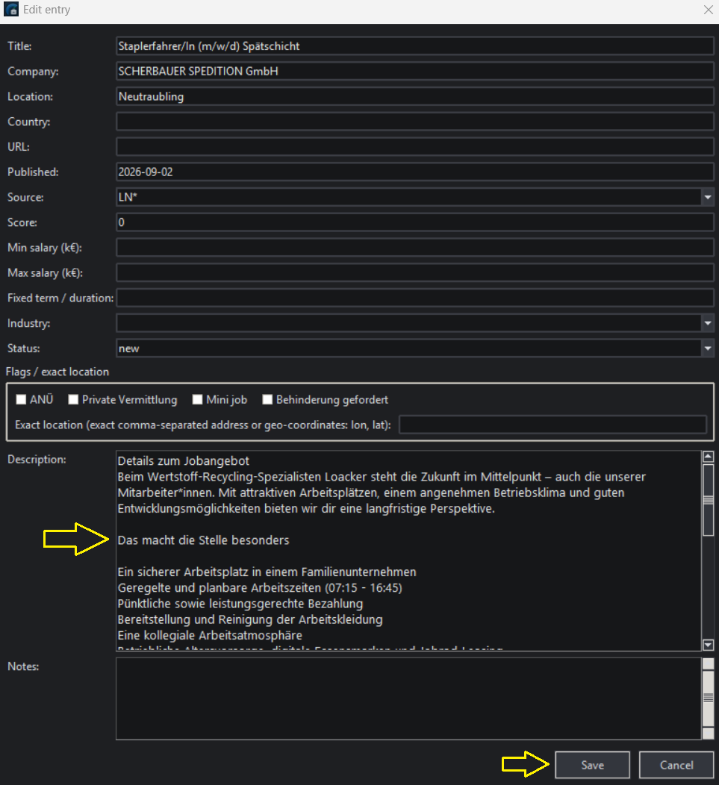

# LinkedIn List Import

This guide will explain how to manually copy a LinkedIn search-result list into JobRadar and how to work with the imported entries.

> 💡 This workflow requires AI, because AI is used to identify job entries in the provided text and to convert it to a list of job entries. Without AI you can still add individual entries manually (via the **Add entry** button in the main window).

## Important limitation

JobRadar does not automatically scrape LinkedIn job advertisements.

The list import is intentionally manual. Individual job descriptions may still need to be copied into JobRadar one by one when you want to inspect/store the complete posting.

The main advantage of importing search results from LinkedIn and other services is only to perform a shallow screening on the list with AI and deep screenings of individual entries. You can also add entries manually to JobRadar to just track your application progress there.

## Example workflow for LinkedIn

The usual workflow is as follows:

1. Do a job search on the LinkedIn website (e.g. search for: Gabelstaplerfahrer)
2. You should get a result like this, where the list of found jobs is in the left panel:

3. Now place the mouse cursor at the beginning of the list (for LinkedIn this is a small area where the yellow arrow points to):

4. Hold down the left mouse button and move the mouse cursor down. This should automatically scroll down the list and mark all entries (if not you can use the mouse wheel to scroll). Continue to the end of list and stop approximately where the yellow arrow is shown in the following screenshot:

5. Release the left mouse button and press `Ctrl+C` to copy the selected text.
6. Switch to JobRadar and press the `List import` button in the main window
7. In the upcoming dialog select the big text field and press `Ctrl+V` to insert the text:

8. Choose the correct provider (in this case `LN` (for LinkedIn)) and let the AI process and import the list via the **Import with AI** button:

9. Wait until the AI is done (the import dialog will close automatically). The results should now be visible in the JobRadar main table
10. Select all imported elements and perform a shallow screening (apply the AI results when the screening is done and then close the window)
11. The main table should now show the screening results, with colors indicating how fitting they probaly are to your profile (in this example very badly):

> ⚠️ Note that so far only the list has been importet! JobRadar has no idea about the actual job descriptions!

12. Reject unfitting jobs and reduce the list to only relevant candidates.
13. Select a promising entry and choose **Edit entry** from the context menu. In the upcoming dialog you see a big and empty **Description** text field: This is where we need to put the actual job description.
14. Return to the LinkedIn website in the browser and select the corresponding job entry. In the main panel scroll down until you find the job description. Usually you have to expand the field first:

15. Select the entire text, copy it with `Ctrl+C` and paste it into the JobRadar **Description** field via `Ctrl+V`. Finally press the **Save** button and the dialog closes. Now the job description is available in JobRadar:

16. Perform a deep screening of the job and investigate it further.

> ℹ️ The same approach works in pretty much the same way with Indeed and many other job search sites.